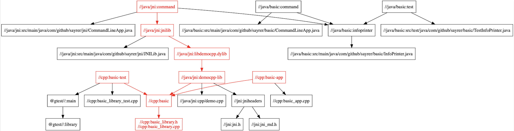

# Bazel Lesson 2 (incomplete WIP)

If you haven't read [Bazel Lesson 1](https://github.com/sayrer/bazel-lesson-1) yet, go do that now. It's not a very long read, and skipping it would only be cheating yourself.

Lesson 1 might have seemed like a bit of a parlor trick, where one build system just happened to be able to build both C++ and Java, and then combine them with JNI. Lesson 2 will show that this is a general pattern in Bazel, and not a narrowly-defined capability. 
To recap, Lesson 1 built a number of C++ and Java tests and binaries. It then showed that only the build products using a basic C++ static library had precise dependencies on it. For example, if the static library were changed, only tests that actually depended on it would need to be rerun. This feature is quite a bit more powerful than incremental compilation as seen in many compiler toolchains--it is cross-language and reflects test results and dependencies. Here's an illustration that shows which build products actually depend on [Lesson 1](https://github.com/sayrer/bazel-lesson-1)'s basic C++ static library:



Lesson 1 didn't go into the contents of [its WORKSPACE](https://github.com/sayrer/bazel-lesson-1/blob/master/WORKSPACE), and there really isn't much in there. All it does is load one function, `http_archive`, which gives Bazel the ability to download files over http. The `http_archive` rule has smarts to decompress `.zip`, `.tar.gz`, `.bzip2`, etc, and then use the supplied `BUILD` file to create a build product from its decompressed contents. In this case, `gtest.BUILD` builds the GoogleTest C++ library, and it's used in the C++ tests.

One flaw in [Lesson 1](https://github.com/sayrer/bazel-lesson-1)'s setup is that it depends on the C++ and Java toolchain installed on the host machine. This could lead to situations that are colloquially known as "works on my machine", where a project has dependencies not reflected in its build system (fortunate developers might find them written down in a wiki or something).

# C++ and Java toolchains

On macOS, it's difficult to use a custom C/C++ toolchain, unless you're building something equivalent to a Unix command line tool or targeting a non-Apple device. Although it's possible to use a custom compiler and linker, macOS and iOS apps will still depend on the SDKs installed on the build machine. On Linux, it's possible to supply everything a build depends on via a [sysroot](https://stackoverflow.com/questions/39920712/what-is-a-sysroot-exactly-and-how-do-i-create-one). Another way to sidestep these issues is to build inside a Docker container where possible. This method can be a lot easier at first, but it tends to accumulate cruft in Dockerfiles that's hard to unwind.

Bazel ships with a minimal JDK used to run Bazel itself, and then downloads a full JDK if you actually build JVM programs. You can control this with the [java_toolchain](https://docs.bazel.build/versions/master/be/java.html#java_toolchain) rule and arguments. As an example, the Gerrit project has a fairly detailed [Bazel setup](https://gerrit.googlesource.com/gerrit/+/master/Documentation/dev-bazel.txt). Bazel doesn't yet seem to be fully free of dependencies on the local JDK, or it is at least buggy when macOS contains a stub `javac` command (the one that pops up a Java installation dialog).

Most projects can probably sidestep these issues by standardizing on a Docker image for Linux builds that contains a JDK. macOS workstations will need to require a specific XCode and JDK version. Then, absolutely everything else should be built by Bazel if possible. If you run a [caching build server](https://docs.bazel.build/versions/master/remote-caching.html), you can check its hit rate to take a pulse on these issues.

# Installing support for other languages

Lesson 2 adds support for Go and Rust. Here's the section of `WORKSPACE` that loads the Go toolchain:

```
#
# Go Rules
#
http_archive(
    name = "io_bazel_rules_go",
    url = "https://github.com/bazelbuild/rules_go/releases/download/0.18.3/rules_go-0.18.3.tar.gz",
    sha256 = "86ae934bd4c43b99893fc64be9d9fc684b81461581df7ea8fc291c816f5ee8c5",
)
load("@io_bazel_rules_go//go:deps.bzl", "go_rules_dependencies", "go_register_toolchains")
go_rules_dependencies()
go_register_toolchains()
```

For Go, we'll first build a project with hand-written Bazel rules.

```
$ more go/basic/BUILD 
load("@io_bazel_rules_go//go:def.bzl", "go_binary", "go_library", "go_test")

go_library(
    name = "go_default_library",
    srcs = [
        "basic.go",
    ],
    importpath = "github.com/sayrer/bazeldemo/basic",
    visibility = ["//visibility:public"],
)

go_test(
    name = "go_default_test",
    srcs = ["basic_test.go"],
    embed = [":go_default_library"],
)

go_binary(
    name = "command",
    srcs = ["main.go"],
    deps = [":go_default_library"],
)
```

There's nothing too surprising here in comparison to the C++ and Java projects. At the top of the file, we load the Go extensions to Bazel. In the `go_library` rule, there's an argument called `importpath` that allows other Go files to load the library with Go's URL-inspired import syntax.

#
# Skylib (Rust rules depend on this)
#
http_archive(
    name = "bazel_skylib",
    sha256 = "2c62d8cd4ab1e65c08647eb4afe38f51591f43f7f0885e7769832fa137633dcb",
    strip_prefix = "bazel-skylib-0.7.0",
    url = "https://github.com/bazelbuild/bazel-skylib/archive/0.7.0.tar.gz",
)

#
# Rust Rules
#
http_archive(
   name = "io_bazel_rules_rust",
   sha256 = "19c546681b2e1d5f98ca5b7e9f28975682a19b0c18d80db2e25d79a949e5e57b",
   strip_prefix = "rules_rust-761ef8f820a96c87a288b4f499b7f61772733f32",
   urls = [
       "https://github.com/bazelbuild/rules_rust/archive/761ef8f820a96c87a288b4f499b7f61772733f32.tar.gz",
   ],
)
load("@io_bazel_rules_rust//rust:repositories.bzl", "rust_repositories")
rust_repositories()
load("@io_bazel_rules_rust//:workspace.bzl", "bazel_version")
bazel_version(name = "bazel_version")
```